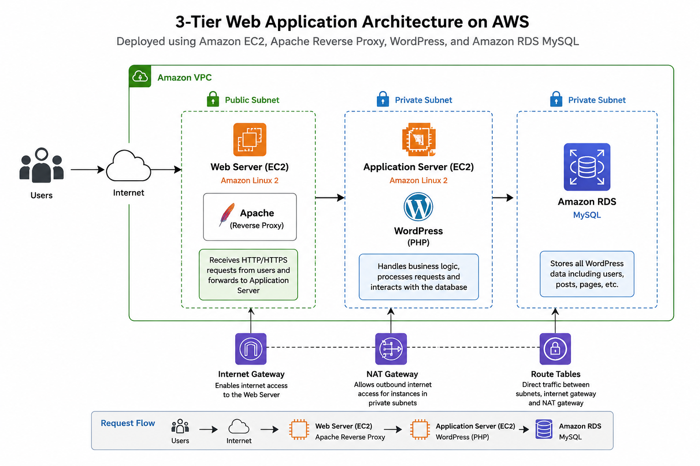
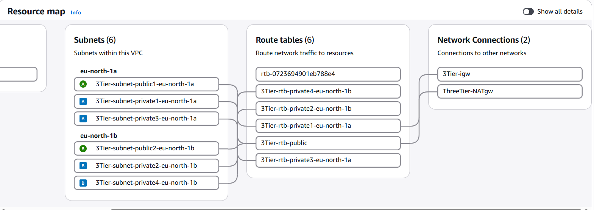
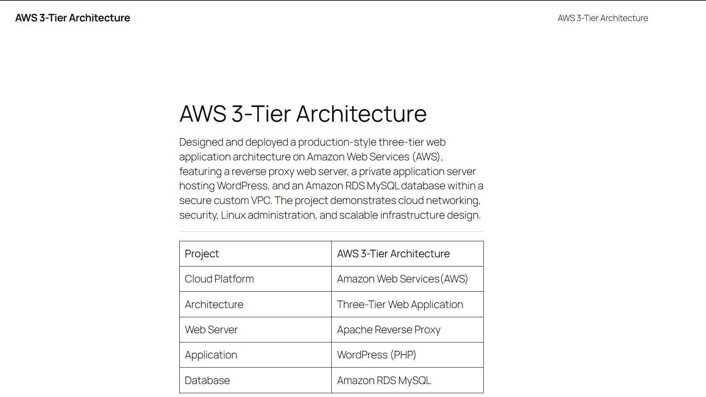
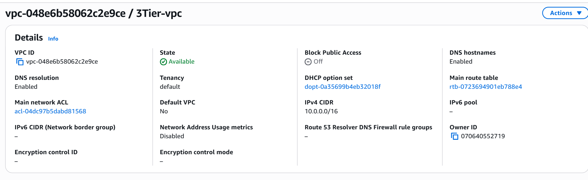
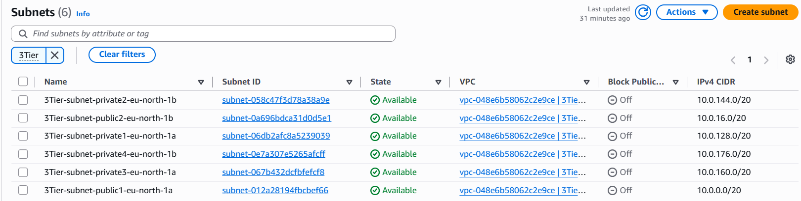
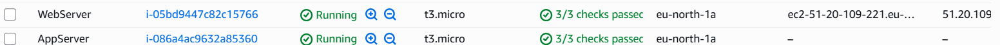
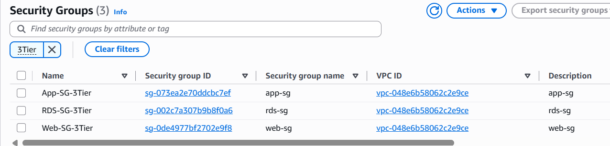
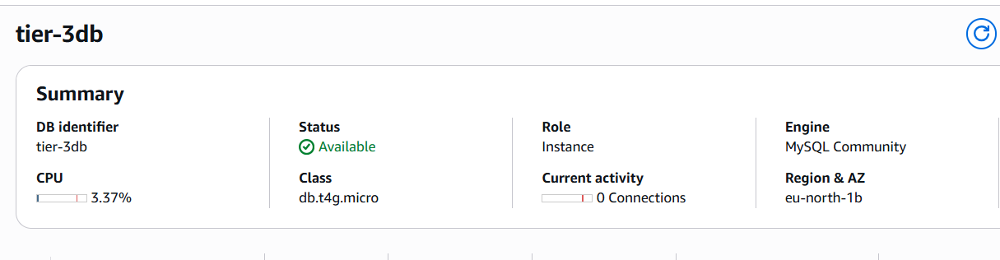
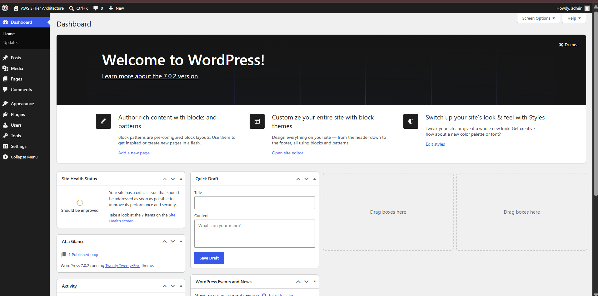

# AWS 3-Tier Web Application Architecture on AWS
## 📑 Table of Contents

- [Project Overview](#-project-overview)
- [Project Highlights](#-project-highlights)
- [Architecture](#️-architecture)
- [Tech Stack](#️-tech-stack)
- [Deployment Guide](#-deployment-guide)
- [Deployment Screenshots](#-deployment-screenshots)
- [Security Architecture](#-security-architecture)
- [Challenges & Solutions](#️-challenges--solutions)
- [Learning Outcomes](#-learning-outcomes)
- [Future Improvements](#-future-improvements)
- [Author](#-author)

A production-inspired three-tier web application architecture deployed on **Amazon Web Services (AWS)** using **Amazon EC2, Apache Reverse Proxy, WordPress, and Amazon RDS MySQL** within a secure custom Virtual Private Cloud (VPC).

This project demonstrates the design and deployment of a secure, scalable, and maintainable cloud infrastructure by separating the web, application, and database layers. It follows AWS networking and security best practices, providing hands-on experience with cloud infrastructure, Linux administration, reverse proxy configuration, and managed database integration.

---

## ✨ Project Highlights

- Designed and deployed a production-inspired **3-tier architecture** on AWS.
- Configured an **Apache Reverse Proxy** to securely route client requests.
- Hosted **WordPress** on a private Amazon EC2 instance.
- Integrated **Amazon RDS MySQL** as the managed database backend.
- Built a secure network using **Amazon VPC**, public/private subnets, route tables, NAT Gateway, and Security Groups.
- Implemented network isolation following **least-privilege security principles**.

## 🏗️ Architecture

The application follows a **three-tier architecture**, where the presentation, application, and database layers are deployed independently to improve security, scalability, and maintainability.

### Architecture Diagram

  

### AWS Resource Map

  

### 🎥 Project Demo

Watch the complete deployment walkthrough:

---
### Architecture Overview

The solution is deployed inside a **custom Amazon VPC** and consists of three logical tiers:

### 🌐 Web Tier

- Public Amazon EC2 instance
- Apache HTTP Server configured as a Reverse Proxy
- Receives incoming HTTP requests from users
- Forwards requests securely to the private application server

---

### ⚙️ Application Tier

- Private Amazon EC2 instance
- Hosts the WordPress application
- Executes PHP code
- Processes client requests
- Communicates with Amazon RDS over private networking

---

### 🗄️ Database Tier

- Amazon RDS MySQL
- Deployed in a private subnet
- Stores WordPress data
- Not publicly accessible
- Accessible only from the Application Tier

---

### Network Components

- Custom Amazon VPC
- Public & Private Subnets
- Internet Gateway
- NAT Gateway
- Route Tables
- Security Groups

These components ensure secure communication between application tiers while restricting unnecessary public access.

## 🛠️ Tech Stack

### Cloud Services
- Amazon EC2
- Amazon VPC
- Amazon RDS (MySQL)
- Security Groups
- Internet Gateway
- NAT Gateway
- Route Tables

### Web Technologies
- Apache HTTP Server
- WordPress
- PHP
- MySQL

### Operating System
- Amazon Linux 2023

---

## 🚀 Deployment Guide

The following steps outline the deployment process of the three-tier web application architecture on Amazon Web Services.

### Step 1: Create a Custom VPC

- Created a custom Amazon VPC to isolate network resources.
- Configured public and private subnets across the VPC.
- Attached an Internet Gateway for public internet access.
- Configured a NAT Gateway to provide outbound internet connectivity for private resources.

---

### Step 2: Configure Networking

- Created Route Tables for public and private subnets.
- Associated subnets with their respective Route Tables.
- Configured Security Groups to control communication between the Web, Application, and Database tiers.

---

### Step 3: Launch EC2 Instances

Provisioned two Amazon EC2 instances:

**Web Server**
- Public Subnet
- Apache HTTP Server
- Reverse Proxy Configuration

**Application Server**
- Private Subnet
- WordPress
- PHP

---

### Step 4: Configure Apache Reverse Proxy

- Installed Apache HTTP Server.
- Enabled proxy modules.
- Configured the Web Server to forward requests securely to the private Application Server.
- Preserved client host information using Apache Reverse Proxy directives.

---

### Step 5: Deploy WordPress

- Installed PHP and required dependencies.
- Downloaded and configured WordPress.
- Connected WordPress to the Amazon RDS MySQL database.
- Completed the WordPress installation through the browser.

---

### Step 6: Configure Amazon RDS

- Created an Amazon RDS MySQL instance.
- Configured database credentials.
- Enabled private connectivity between the Application Server and RDS.
- Updated the WordPress configuration with the database endpoint and credentials.

---

### Step 7: Test the Deployment

Validated the deployment by:

- Accessing the application through the public Web Server.
- Verifying Reverse Proxy functionality.
- Testing database connectivity.
- Confirming successful WordPress installation.
- Validating secure communication between all application tiers.

---

## 📸 Deployment Screenshots

The following screenshots showcase the successful deployment and configuration of the AWS three-tier architecture.

## Deployment Gallery

### VPC

### Subnets

### EC2 Instances

### Security Groups

### Amazon RDS

### WordPress Dashboard

### Live Website

## 🔒 Security Architecture

Security was a key consideration throughout the deployment of this architecture.

The following measures were implemented to protect the infrastructure:

- Application Server deployed in a private subnet with no direct public access.
- Amazon RDS MySQL deployed in a private subnet.
- Security Groups configured following the principle of least privilege.
- Apache Reverse Proxy used to expose only the Web Tier to the Internet.
- Private communication established between the Application and Database tiers.
- Network isolation achieved using a custom Amazon VPC with public and private subnets.

These configurations ensure that only authorized traffic flows between infrastructure components while minimizing the attack surface.

## ⚠️ Challenges & Solutions

| Challenge | Solution |
|-----------|----------|
| Unable to connect to the EC2 instance through SSH after the public IP changed. | Updated the Security Group inbound rule to allow SSH access from the current client IP. |
| WordPress redirected users to incorrect URLs, causing a redirect loop. | Corrected the `siteurl` and `home` values in the database and configured Apache Reverse Proxy with `ProxyPreserveHost`. |
| Reverse Proxy configuration | Configured Apache to securely forward incoming requests from the Web Server to the private Application Server. |
| Database connectivity | Configured WordPress to communicate securely with Amazon RDS using private networking and verified connectivity. |
| Secure communication between application tiers | Configured Security Groups to allow only the required traffic between the Web, Application, and Database tiers. |

## 💡 Learning Outcomes

This project provided hands-on experience with designing and deploying production-inspired cloud infrastructure on AWS.

Key learnings include:

- Designing secure three-tier cloud architectures.
- Configuring Amazon VPC networking components.
- Managing Linux-based EC2 instances.
- Configuring Apache HTTP Server as a Reverse Proxy.
- Deploying and configuring WordPress.
- Integrating applications with Amazon RDS MySQL.
- Implementing secure communication using Security Groups.
- Troubleshooting real-world deployment and networking issues.

  ## 🔮 Future Improvements

Potential enhancements for this project include:

- Configure HTTPS using AWS Certificate Manager (ACM) and an Application Load Balancer.
- Register a custom domain using Amazon Route 53.
- Implement Auto Scaling for improved availability.
- Automate infrastructure deployment using Terraform or AWS CloudFormation.
- Integrate Amazon CloudWatch for monitoring and logging.
- Build a CI/CD pipeline using GitHub Actions or AWS CodePipeline.

  ## 👩‍💻 Author

**Advika Pundir**

Cloud & DevOps Intern

📧 Email: advikapundir0316@gmail.com

💼 LinkedIn: https://www.linkedin.com/in/advika-pundir-65514a28b/

💻 GitHub: https://github.com/advikapundir

📂 Project Repository: https://github.com/advikapundir/AWS-3Tier-LAMP-Architecture
